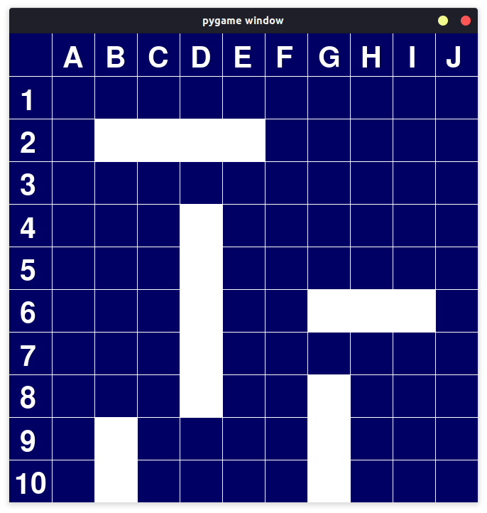
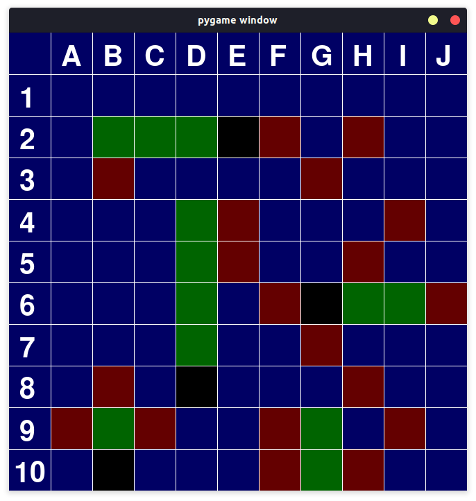
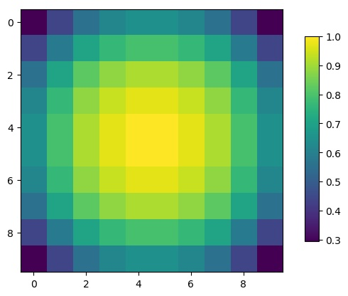

# Conception, Implémentation et optimisation de plusieurs intelligences artificielles capable de gagner à la bataille navale

### Julie Veschambre, Pierre Boistier, Milan Gonzalez-Thauvin

TIPE réalisé pendant l'année scolaire 2019-2020 par Julie Veschambre, Pierre Boistier et Milan Gonzalez-Thauvin. Il n'a pas été achevé en raison de la crise sanitaire et de l'annulation de l'épreuve de TIPE en mars 2020.


## Motivation
Le jeu de la bataille navale est un jeu aussi divertissant qu'intéressant à étudier. C'est donc avant tout son coté ludique et l'optique d'implémenter un programme capable de battre un être humain qui m'a poussé à choisir ce sujet.


## Ancrage au thème
Le jeu de la bataille navale est le jeu de société de référence lorsqu'il s'agit d'affrontements en mer. C'est pour cette raison que son étude et en particulier l'implémentation d'un amiral artificiel performant rentre parfaitement dans le cadre du thème "Océan".

## Positionnements thématique
* INFORMATIQUE (Informatique pratique)
* INFORMATIQUE (Informatique Théorique)
* MATHÉMATIQUES (Mathématiques Appliquées)

## Mots-clés
* Bataille navale / Battleship
* Théorie des Jeux / Game theory
* Intelligence artificielle / Artificial Intelligence
* Apprentissage supervisé / Supervised learning
* Apprentissage par renforcement / Reinforcement learning


## Bibliographie commentée
La Bataille navale est un jeu de société dans lequel deux joueurs s’affrontent sur un océan virtuelle, chacun tentant de couler la flotte adverse, dont les positions sont tenus secrète [1]. À première vue, gagner à la bataille navale peut sembler ne relever que du hasard. Il n'en est rien : il existe des méthodes et des stratégies capable d'augmenter drastiquement les chances de victoire, notamment en diminuant le nombre moyen de coups nécessaires pour couler une configuration donnée, que l'on supposera choisi aléatoirement grâce à une distribution uniforme sur l'ensemble des grilles possible.  
La première stratégie possible est probabiliste et a été expérimentée par Nick Berry et Alex Alemi, respectivement en [2, 3]. L'idée est d'utiliser astucieusement les règles du jeu pour ne faire feu que sur des positions avantageuse, et ainsi réduire le nombre de coups avant la victoire. Poussée à l’extrême, cette stratégie permet de connaître à tout instant, la probabilité exacte qu'un bateau se trouve sur une case donnée.  
Peut on faire mieux ? Il s'agit de la question fondamentale du TIPE, et les deux pistes envisagées utilisent l'apprentissage profond [4].  
La première se concentre sur les performances temporelles : il s'agit d'imiter le calcul de la densité de probabilité en utilisant l'apprentissage supervisé par un réseau de neurone [5]. Ainsi, une fois entraîné, le réseau pourrait obtenir des résultats similaires à ceux du meilleur algorithme probabiliste, mais en beaucoup moins de temps.  
La deuxième, beaucoup plus ambitieuse, consiste à utiliser l'apprentissage par renforcement [7, 8] pour former une IA complètement indépendante, qui apprendrait d'elle même et créerait de nouvelles stratégies. En effet, on pourrait penser intuitivement que la meilleure stratégie possible consiste à toujours viser la case la plus probable. Cependant, il existe des jeux de société (le Mastermind par exemple) où il peut s'avérer malin de faire un choix qui ne mènera pas à la victoire mais qui apporte une grande quantité d'information, et qui servira à gagner plus vite. Qu'en est il de la bataille navale ?  
Pour mettre cela en place, nous implémenterons nos propres algorithmes d'apprentissage profond (notamment grâce à [6]), et utiliserons des librairies tel que TensorFlow [9]. Nous comparerons les résultats.  
Enfin, nous pouvons remarquer que si de nombreuses stratégies et intelligences artificielles capable de gagner à la bataille navale existent, aucun travail ne compare explicitement leurs performances.

## Problématiques
Qu'est-ce que la bataille navale et quelles sont les stratégies classiques permettant de gagner en un minimum de coups ?  
Quelles sont les différentes formes d'intelligence artificielles adapté à ce problème ?  
Comment entraîner les IA qui le nécessite ?  
Quelles performances peut on attendre de ces IA ?

## Objectifs
* Comprendre les enjeux du jeu de la bataille navale
* Implémenter un environnement et une interface permettant de jouer à la bataille navale
* Concevoir et Implémenter une IA utilisant une stratégie probabiliste
* Concevoir, implémenter et entraîner une IA utilisant l'apprentissage supervisé grâce à un réseau de neurone
* Concevoir, implémenter et entraîner une IA utilisant l'apprentissage par renforcement
* Comparer les performances (en terme de temps et de résultats) des différentes IA et en tirer une conclusion

## Références bibliographiques
\[1] : Bataille navale (jeu), Wikipédia, https://fr.wikipedia.org/wiki/Bataille_navale_%28jeu%29  
\[2] : Battleship, Nick Berry, 2011, http://www.datagenetics.com/blog/december32011/index.html  
\[3] : The Linear Theory of Battleship, Alex Alemi, 2011, https://thephysicsvirtuosi.com/posts/old/the-linear-theory-of-battleship  
\[4] : Introduction au Machine Learning, Chloé-Agathe Azencott, 2019, Dunod  
\[5] : Deep learning en action : la référence du praticien, Adam Gibson, 2018, O'Reilly  
\[6] : Neural Network and Deep Learning, Michael Nielsen, http://neuralnetworksanddeeplearning.com  
\[7] : A Beginner's Guide to Deep Reinforcement Learning, Chris Nicholson, https://pathmind.com/wiki/deep-reinforcement-learning  
\[8] : Deep reinforcement learning, battleship, Jonathan Landy, 2016, http://efavdb.com/battleship  
\[9] : TensorFlow for Deep Learning, Bharath Ramsundar & Reza Bosagh Zadeh, 2018, O'Reilly


# Implémentation

Implémentation en Python3. Modules utilisés : numpy, matplotlib, pygame

## Exemple d'utilisation

```
Modes :
0 : Jeu
1 : Performances
2 : Enregistrer un cornichon
3 : Enregistrer une IA
4 : Entraîner une IA
5 : Afficher proba diapo
6 : Mode manuel
> 0

Interface :
0 : Non
1 : Oui
> 0

Defenseur :
0 : Humain
1 : HasardDefense
2 : HasardDefenseCornichon
3 : ConfigInit
> 1

Attaquant :
0 : Humain
1 : HasardDebile
2 : HasardMalin
3 : ChasseEtPeche
4 : ChassePecheCroix
5 : ChassePecheCroixProba
6 : ChassePecheProba
7 : ChassePecheProbaCroixDecroissanceLineaire
8 : ChassePecheProbaCroixDecroissanceExpo
9 : IaSl
> 6

Partie terminée en 28 coups
```

## Interface codé avec Pygame

 

## Matrices de probabilité de quelques situations



## Comparaison des différents algorithmes


# Progression

État des objectifs en mars 2020 :
- [x] Comprendre les enjeux du jeu de la bataille navale
- [x] Implémenter un environnement et une interface permettant de jouer à la bataille navale :
- [x] Concevoir et Implémenter une IA utilisant une stratégie probabiliste
- [ ] Concevoir, implémenter et entraîner une IA utilisant l'apprentissage supervisé grâce à un réseau de neurone : **Stade avancé**
- [ ] Concevoir, implémenter et entraîner une IA utilisant l'apprentissage par renforcement : **Théorie acquise**
- [x] Comparer les performances (en terme de temps et de résultats) des différentes IA et en tirer une conclusion **Pour les algorithmes déjà implémentés**
